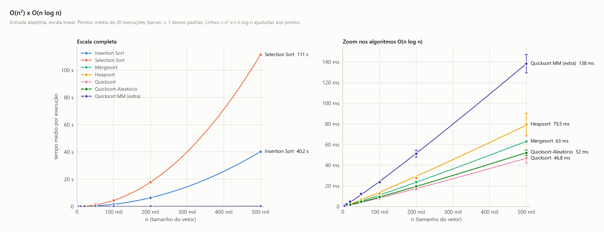
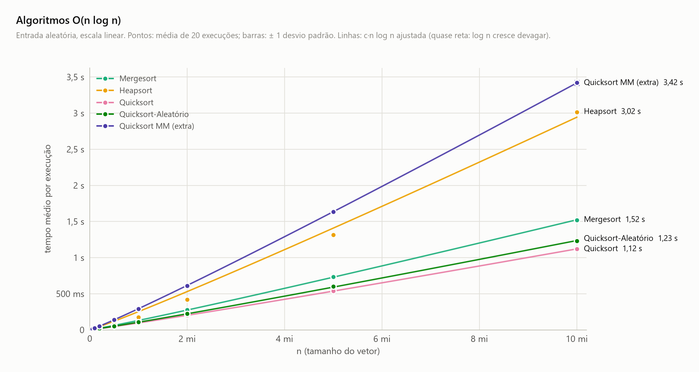
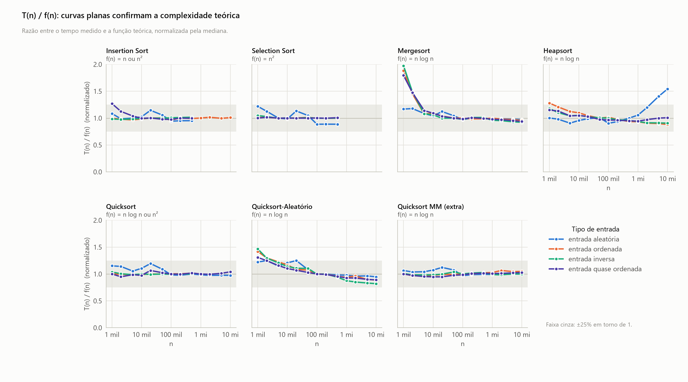

<!-- Gerado por analise/analise.py a partir dos dados; não edite à mão. -->

# Complexidade: tempo medido × teoria

## O(n²) × O(n log n)

- **Escala:** linear nos dois eixos. O painel da direita é um zoom no mesmo eixo de n, com tempo em milissegundos.
- **Conteúdo:** entrada aleatória. Pontos = média; barras = ± 1 desvio padrão; linhas = curvas c·n² e c·n log n ajustadas. Média de 20 execuções por ponto.
- **O que se observa:** as parábolas do Selection (111 s) e do Insertion (40,2 s) com n = 500 mil, enquanto os cinco O(n log n) ficam entre 46,8 ms e 138 ms.

## Algoritmos O(n log n)

- **Escala:** linear nos dois eixos, n até 10 mi.
- **Conteúdo:** entrada aleatória. Pontos = média; barras = ± 1 desvio padrão; linhas = c·n log n ajustada. Média de 20 execuções por ponto.
- **O que se observa:** as curvas parecem retas porque log n cresce devagar. Com n = 10 mi, do mais rápido ao mais lento: Quicksort 1,12 s, Quicksort-Aleatório 1,23 s, Mergesort 1,52 s, Heapsort 3,02 s, Quicksort MM (extra) 3,42 s. Os pontos do Heapsort se afastam da curva para n grande (efeito de cache).

## T(n) / f(n): confirmação da complexidade

- **Escala:** n em escala log; eixo vertical linear, de 0 a 2.
- **Conteúdo:** tempo medido dividido pela função teórica f(n) de cada caso (n, n log n ou n²), normalizado pela mediana. Faixa cinza = ±25%.
- **O que se observa:** curvas planas em torno de 1 confirmam a complexidade. Para n ≥ 100 mil, todas ficam a até 18% de 1, exceto o Heapsort na entrada aleatória, que chega a 1,54 com n = 10 mi (falhas de cache). Desvios em n pequeno vêm de ruído de medição.
