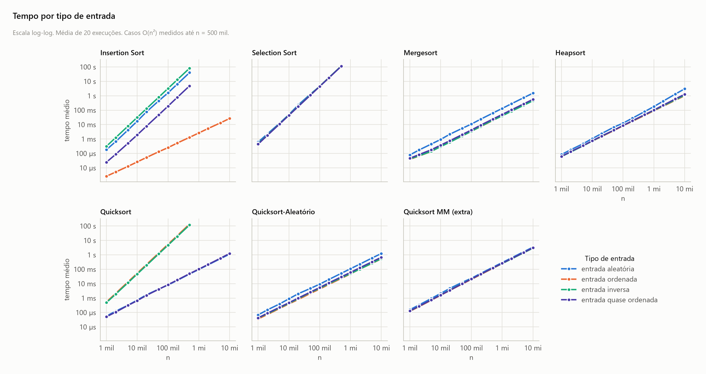

<!-- Gerado por analise/analise.py a partir dos dados; não edite à mão. -->

# Melhor e pior caso: efeito do tipo de entrada

## Tempo por tipo de entrada

- **Escala:** log-log (uma parábola vira reta de inclinação 2; n log n, inclinação ≈ 1). Eixos iguais em todos os painéis.
- **Conteúdo:** um painel por algoritmo, uma linha por tipo de entrada. Média de 20 execuções por ponto.
- **O que se observa:** o Insertion muda de classe conforme a entrada: 1,3 ms com vetor ordenado (melhor caso, O(n)) contra 81,5 s com vetor inverso (pior caso), n = 500 mil. O Quicksort clássico vira O(n²) com vetor ordenado ou inverso. Selection, Merge e Heap quase não dependem da entrada.
