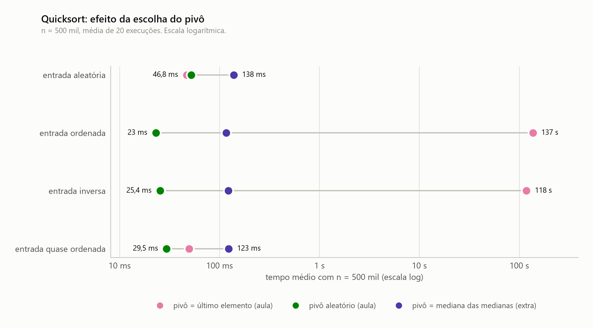
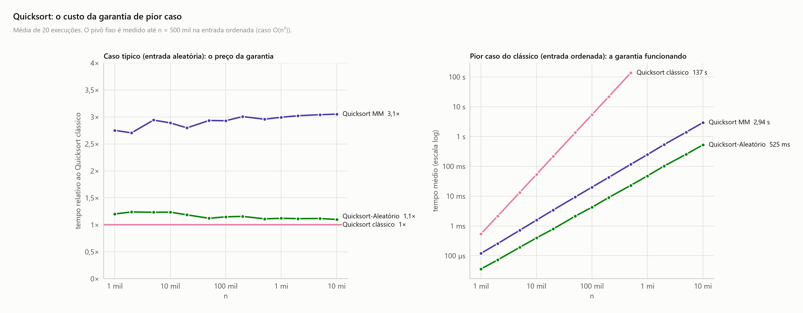

<!-- Gerado por analise/analise.py a partir dos dados; não edite à mão. -->

# Quicksort: escolha do pivô

## Quicksort: efeito da escolha do pivô

- **Escala:** tempo em escala log (cada divisão = 10×).
- **Conteúdo:** tempo médio das três escolhas de pivô em cada entrada, com n = 500 mil. Média de 20 execuções por ponto.
- **O que se observa:** com vetor ordenado, o pivô fixo leva 137 s, contra 23 ms do aleatório e 117 ms da mediana das medianas. Na entrada aleatória, o pivô fixo (46,8 ms) e o aleatório (52 ms) quase empatam, e a mediana das medianas leva 138 ms.

## Quicksort: o custo da garantia de pior caso

- **Escala:** esquerda com n em log e eixo vertical linear (tempo relativo); direita em log-log.
- **Conteúdo:** esquerda, tempo de cada variante dividido pelo do Quicksort clássico na entrada aleatória; direita, tempo na entrada ordenada.
- **O que se observa:** a mediana das medianas custa de 2,7× a 3,1× o clássico em todo n, e o pivô aleatório cerca de 1,1×. Em troca, na entrada ordenada, o clássico sobe como n² até 137 s (n = 500 mil), enquanto o MM e o aleatório seguem n log n até 10 mi.
