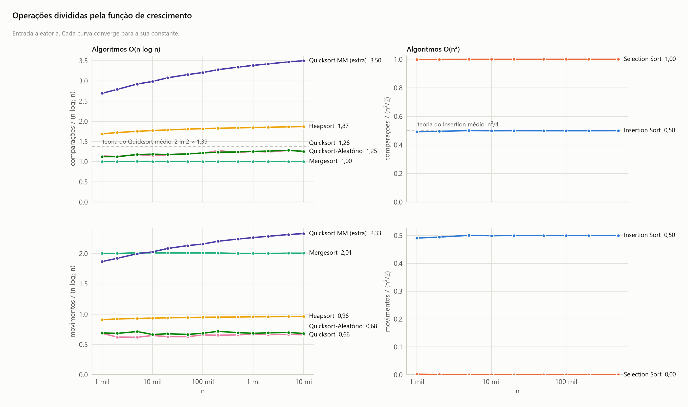

<!-- Gerado por analise/analise.py a partir dos dados; não edite à mão. -->

# Contagem de operações

## Operações divididas pela função de crescimento

- **Escala:** n em escala log; eixo vertical linear.
- **Conteúdo:** comparações (em cima) e movimentos (embaixo) divididos por n log₂ n ou por n²/2, na entrada aleatória. Contagens independem da máquina.
- **O que se observa:** cada curva converge para uma constante. Comparações por n log₂ n com n = 10 mi: Mergesort 1,00, Quicksort 1,26, Heapsort 1,87, Quicksort MM (extra) 3,50 (a teoria do Quicksort médio dá 2 ln 2 ≈ 1,39). Comparações por n²/2 com n = 500 mil: Selection 1,00 (exatamente n(n−1)/2) e Insertion 0,50 (≈ n²/4, como prevê o caso médio).
