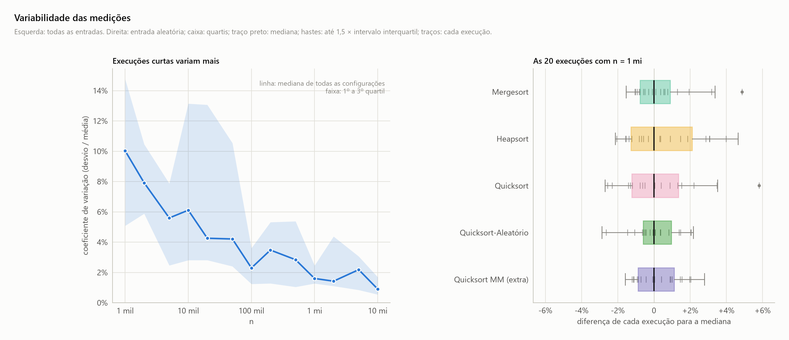

<!-- Gerado por analise/analise.py a partir dos dados; não edite à mão. -->

# Variabilidade das medições

## Variabilidade das medições

- **Escala:** esquerda com n em log e eixo vertical linear (%); direita linear (%).
- **Conteúdo:** esquerda, coeficiente de variação (desvio ÷ média) de todas as configurações; direita, boxplot das 20 execuções com n = 1 mi, como diferença para a mediana.
- **O que se observa:** o coeficiente de variação mediano cai de 10% (n = 1 mil) para 0,9% (n = 10 mi): execuções curtas sofrem mais ruído. Com n = 1 mi, 90% das execuções ficam a ±3% da mediana.
